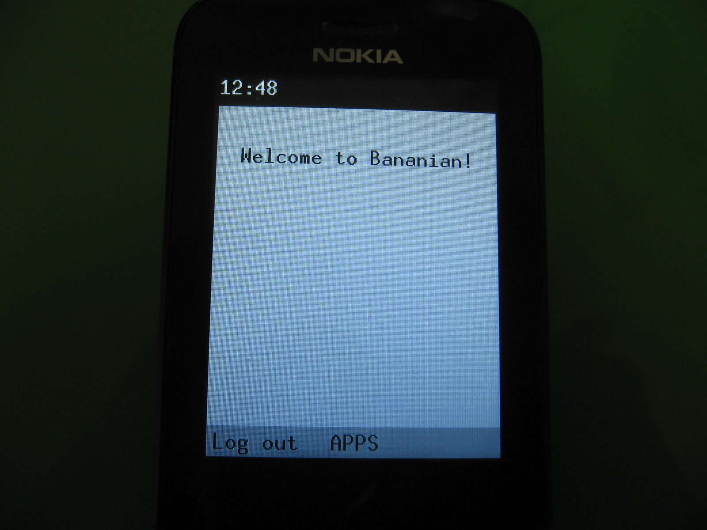

# Bananian - Debian for the Nokia 8110 4G and a UI

Bananian now has its own [Matrix space](https://matrix.to/#/#bananian-sfp-os:matrix.org)!

[How to build Bananian](#building)



## What is Bananian
Bananian is a custom installation of [Debian](https://debian.org) for the
Nokia 8110 4G (and possibly other Qualcomm-based feature phones).
This repository provides some scripts to build helpful packages and install the
system onto your phone.

## What Bananian is not

 - This is not a separate GNU/Linux distro: This is just a custom installation
   of Debian that uses Debian's package repositories with a few packages added
   on top.
 - Bananian is not a replacement for [KaiOS](https://kaiostech.com). However, it
   might become one later once it gets more supported features. It is currently
   meant to be installed side-by-side with KaiOS (into the recovery partition).

### Building
> **NOTE: This has been tested only on Debian and Devuan GNU/Linux. Building on
> Debian-based
> distributions such as Ubuntu might work, but this will certainly not work on
> other operating systems.**

##### Additional system setup (only if you need to build packages from source)

First install pbuilder:
```
# apt install pbuilder
```

and set up the build chroot:
```
# pbuilder create --distribution bullseye
```

#### Starting the build

Then run `make menuconfig` and after that `make` as root.
(Please make sure that nothing malicious happens, as you should always do
when running software you don't trust as root.)

To reconfigure, run `make menuconfig` again.
Other configurators are also available:
 - `config` (plain-text)
 - `nconfig` (new ncurses-based menuconfig alternative)
 - `xconfig` (qt-based, X11 front-end)
 - `gconfig` (gtk-based, X11 front-end)

##### Running system setup in QEMU
**QEMU mode is deprecated. It does not emulate the device or the
Bananian system. The bootstrap process is now run on first boot from the
initramfs. You probably don't need to use this mode, this section is included
just for reference.**
QEMU mode runs `debootstrap --second-stage` and various other setup commands in
the qemu-user emulator. The package qemu-user-static is required for this mode.
To enable it, append USE\_QEMU=1 to the make or make install-to-device command:

```
# make install-to-device USE_QEMU=1
```

#### Wireless networking
Currently broken.

### Installing
This step requires a **rooted** phone. See
[BananaHackers](https://sites.google.com/view/bananahackers/root) for more info.

Create two partitions on your SD card. Format the first one as FAT and the
second as EXT4. Unpack `debroot.tar` onto the EXT4 partition (as root!)
and flash the `boot.img` onto the `recovery` partition
(or the `boot` partition if you don't care about KaiOS). Please note that some
firmware is loaded from the system partition, so you shouldn't erase KaiOS
completely.


#### First boot
On first boot, the phone has to complete the installation by running a
bootstrap process (`debootstrap --second-stage`) and a "setup" process which
creates the system user account and installs bananian-specific packages.

During each of these processes, the keypad backlight will blink. Once the
process is completed, the phone will make a short vibration (100ms).

**The bootstrap process can take more than 20 minutes. The setup process
is much shorter and takes about a minute.**

If an error occurs, it will vibrate and blink several times. Note that it won't
reboot unless something crashes the system. Press and hold the Power button
and the D-Pad "down" key to restart the device if it hangs.

### Passwords

The default password for the user `user` is `bananian`.

### SSH access
To get SSH access to your phone, connect it via USB to your PC.

Then run the following on your PC:

```
$ ssh user@10.42.0.1
```

To get root access, use sudo.

### Bugs
Please report an issue if you find a bug. If it's a UI bug, please report it
in the <https://gitlab.com/bananian/wbananui> repository.

### Contribute
If you would like to contribute, you can always submit a merge request.
If you need help developing an app, ask in the **App development** section of
Bananian's Matrix space.

### Kernel
See [KERNEL.md](KERNEL.md)

### Disclaimer
Install this ***at your own risk***! I am not responsible for bricked phones!

This installer is distributed in the hope that it will be useful,
but **WITHOUT ANY WARRANTY**; without even the implied warranty of
**MERCHANTABILITY** or **FITNESS FOR A PARTICULAR PURPOSE**.  See the
GNU General Public License for more details.

Packages included in this distribution have different licenses.
Please see the [LICENSE.notice.md](./LICENSE.notice.md) file,
<https://www.debian.org/legal/licenses/> and the copyright files of the
packages (usually found at `/usr/share/doc/<package>/copyright` on the
installed system) more information
